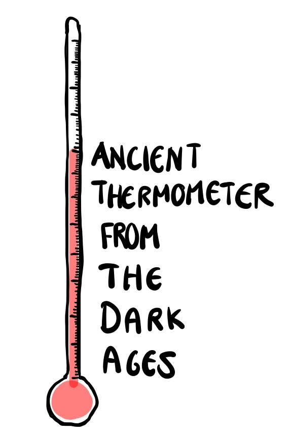
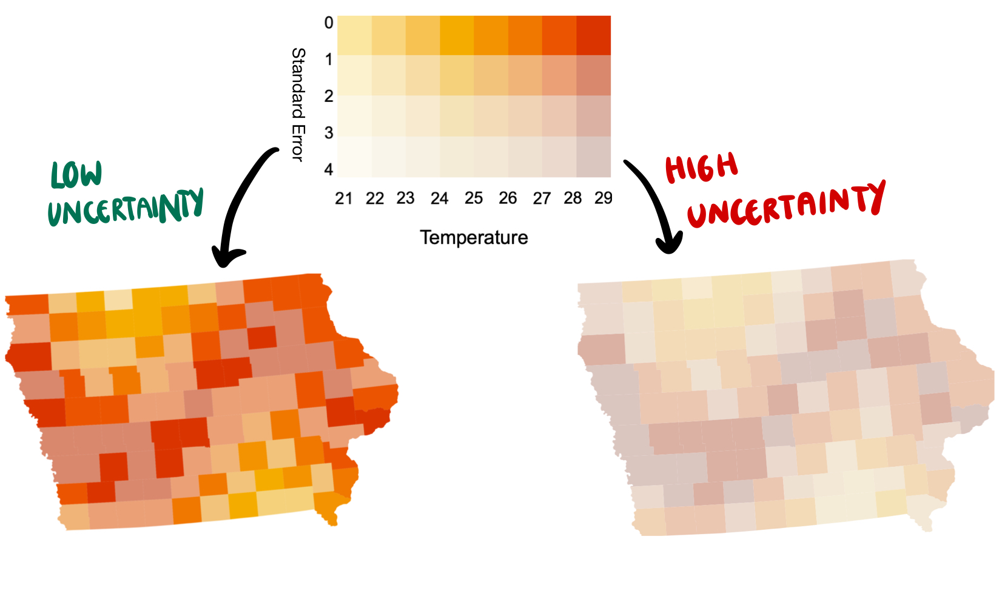
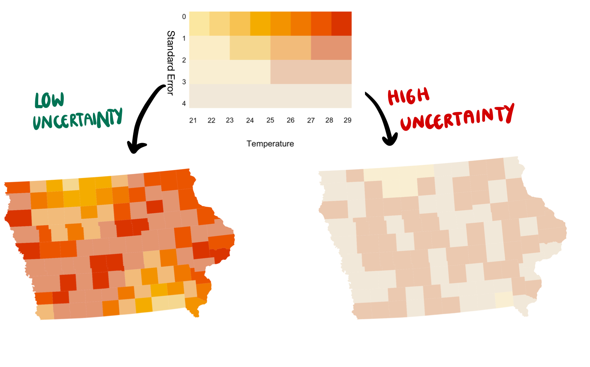
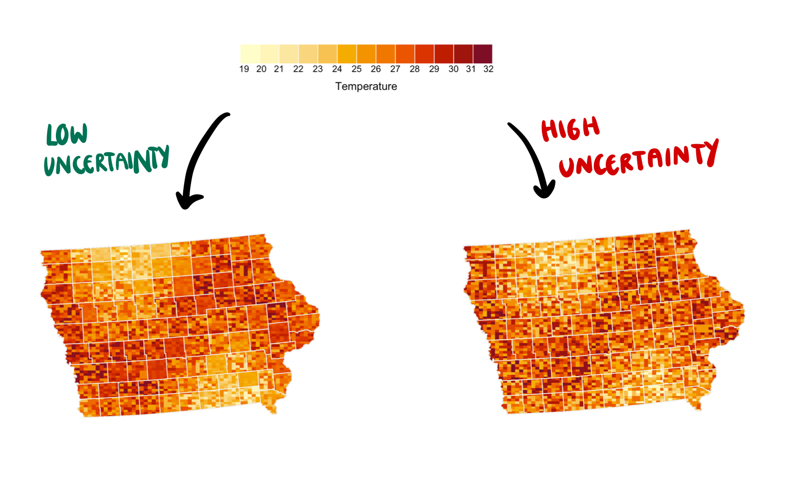
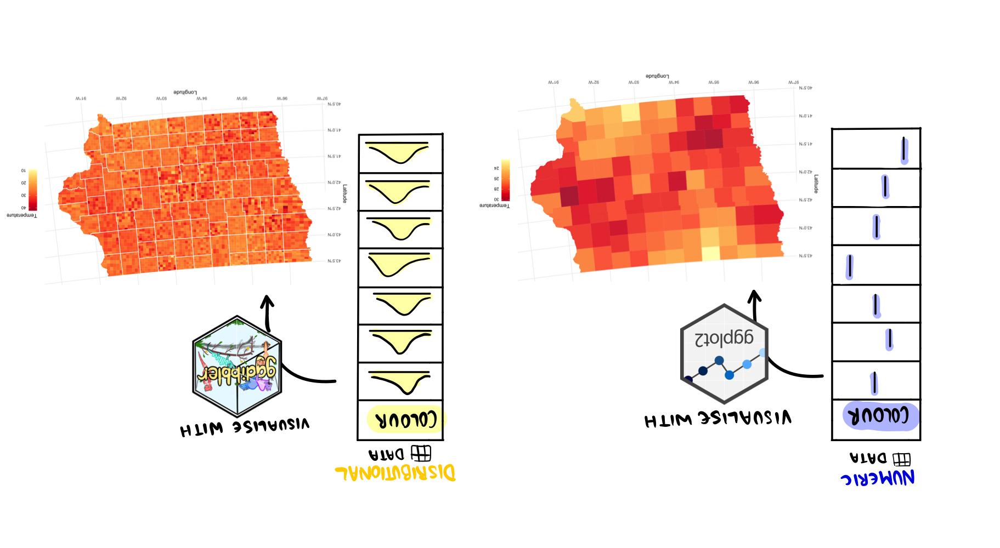

```{r}
#| label: setup
#| include: false
library(ggplot2)
library(tidyr)
library(dplyr)
library(ggdibbler)
library(distributional)
library(cartogram)
library(sf)
library(scales)
library(colorspace)
library(kableExtra)
library(conflicted)
conflicts_prefer(dplyr::filter)
conflicts_prefer(dplyr::select)
conflicts_prefer(dplyr::slice)
conflicts_prefer(dplyr::rename)
conflicts_prefer(dplyr::mutate)
conflicts_prefer(dplyr::summarise)
options(digits=3, 
        repr.plot.width=15,
        repr.plot.height=8)

# {fig-align="center"}
```

# Session 2 <br> Diving deeper into uncertainty visualisation using examples in spatial data {.transition-slide style="align: center;"}

# Introduction to Spatial Visualisation {.transition-slide style="align: center;"}

## Why focus on spatial visualisations?

- Spatial case is a good example to work through because the aesthetics we have to express estimates are limited
- Maps take up most of the usual aesthetics by being a representation of space
  - position, size, shape, etc. all have an implicit meaning in the mapping context
  - colour/fill is usually the only aesthetic we have left
  - can also get creative and do glyph maps (we will ignore this variation here)

:::: {.columns}  
::: {.column}
:::

::: {.column}

<br>

::: {.callout-note appearance="simple"}

::: {style="font-size: 150%;"}

Spatial data takes up the two dimensions of the display leaving colour and fill to map uncertainty.

:::
:::
:::
::::

## Example: Citizen Scientist Data  

- There have been reports of a strange spatial pattern in the temperatures of Iowa
- We get some citizen scientists to measure data at their home and report back
- To maintain anonymity, we are only provided with the county of each scientist


```{r}
#| label: show-data
#| fig-align: center
temp_data <- toy_temp |>
  as_tibble() |>
  select(scientistID, county_name, recorded_temp) |>
  head(5)
kbl(temp_data)
```
`990` citizen scientists participated


## We could just plot the data...

* We often can plot the longitude and latitude directly using `geom_point`. 
* While this approach has a low barrier to entry, it lacks the contextual information that gives our plots meaning.

```{r}
#| echo: false
#| fig-align: center
p_data <- ggplot(toy_temp) +
  geom_jitter(aes(x=county_longitude, y=county_latitude, colour=recorded_temp), 
              width=7000, height =7000, alpha=0.7) +
  theme_minimal() +
  labs(x = "Longitude",
       y = "Latitude",
       colour= "Temperature",
       title = "Citizen Scientist Recordings") +
  scale_colour_distiller(palette = "YlOrRd", direction= 1) +
  theme(aspect.ratio=0.7)
p_data
```


## Spatial features objects

* SF objects are differentiated from our usual `tibble` by the additional metata in the Coordinate reference system (CRS)
  + Assumptions about the shape of the planet (geodetic datum)
  + Distortions we will/won't accept when drawing the map (map projection)
  
```{r}
#| label: make-map
#| fig-align: center
#| echo: false
p_data_sf <- ggplot(toy_temp) +
  geom_sf(aes(geometry=county_geometry), fill="white") +
  geom_jitter(aes(x=county_longitude, y=county_latitude, colour=recorded_temp), 
              width=7000, height =7000, alpha=0.7) +
  theme_minimal() +
  labs(x = "Longitude",
       y = "Latitude",
       colour= "Temperature",
       title = "Citizen Scientist Recordings") +
  scale_colour_distiller(palette = "YlOrRd", direction= 1) +
  theme(aspect.ratio=0.7)
p_data_sf
```

## Can you see the spatial trend?

```{r}
p_data_sf
```


## Estimate the county mean

- Visualising an estimate, such as a mean, can make trends easier to see
  + This estimate has a standard error, but we rarely integrate it into our plots


```{r}
#| label: compute-summaries
#| include: false
# Calculate County Mean
mean_print <- toy_temp |> 
  group_by(county_name) |>
  summarise(temp_mean = mean(recorded_temp),
            temp_se = sd(recorded_temp)/sqrt(n()),
            n = n()) |>
  as_tibble() |>
  select(county_name, temp_mean, temp_se, n) |>
  head(5)

toy_temp_mean <- toy_temp |> 
  group_by(county_name, county_longitude, county_latitude) |>
  summarise(temp_mean = mean(recorded_temp),
            temp_se = sd(recorded_temp)/sqrt(n()),
            n = n()) |>
  ungroup()
```

::: {style="font-size: 70%;"}
```{r}
#| label: compute-mean
#| echo: true
#| eval: false
# Calculate County Mean
toy_temp |> 
  group_by(county_name) |>
  summarise(temp_mean = mean(recorded_temp),
            temp_se = sd(recorded_temp)/sqrt(n()),
            n = n()) 
```
::: 

```{r}
kbl(mean_print)
```

## Can you see the trend now?

```{r}
#| label: choropleth
p_choro <- ggplot(toy_temp_mean) +
  geom_sf(aes(geometry=county_geometry, fill=temp_mean), linewidth = 0, alpha=0.9) +
  theme_minimal() +
  scale_fill_distiller(palette = "YlOrRd", direction= 1) +
  xlab("Longitude") +
  ylab("Latitude") +
  labs(fill = "Temperature") +
  theme(aspect.ratio=0.7)
p_choro
```

## Common Map Visualisations

:::: {.columns}

::: {.column width="40%"}

* Usually spatial data is shown using a choropleth map,
  + Choropleth maps shade an area according our statistic of interest
* We can also weight the area by another variable, such as sample size
  + e.g. cartograms, and bubble plots
* Does this plot follow the principles of signal suppression?
* Is there a noticeable difference in the way these plots convey signal?

:::

::: {.column width="60%"}


::: {.panel-tabset}

## Choropleth Map

```{r}
p_choro
```

## Cartogram

```{r}
#| label: cartogram
# Make Cartogram using instructions from r graph gallery
toy_merc <- st_transform(toy_temp_mean, 3857)
toy_cartogram <- cartogram_cont(toy_merc, weight = "n", itermax = 5)
toy_cartogram <- st_transform(toy_cartogram, st_crs(toy_temp_mean))
# plot it
p_cartogram <- ggplot(toy_cartogram) +
  geom_sf(aes(fill = temp_mean), linewidth = 0, alpha = 0.9) +
  theme_minimal() +
  scale_fill_distiller(palette = "YlOrRd", direction= 1) +
  xlab("Longitude") +
  ylab("Latitude") +
  labs(fill = "Temperature") +
  theme(aspect.ratio=0.7)
p_cartogram
```


## Bubble Map

```{r}
#| label: bubble-plot
p_bubble <- ggplot(toy_temp_mean) +
  geom_sf(fill = "white", alpha = 0.9) +
  geom_point(aes(x=county_longitude, county_latitude,
                 colour=temp_mean, size=n), alpha=0.9) +
  theme_minimal() +
  scale_fill_distiller(palette = "YlOrRd", direction= 1) +
  xlab("Longitude") +
  ylab("Latitude") +
  labs(colour = "Temperature") +
  scale_colour_distiller(palette = "YlOrRd", direction= 1) +
  theme(aspect.ratio=0.7, legend.position="none")

p_bubble

```

:::

:::
::::

## But what if the error is worse? {.larger}

:::: {.columns}

::: {.column width=70%} 
- It turns out the citizen scientists are using some pretty old tools.
- The standard error **could** be up to three times what we would estimate with our usual assumptions.
- We want to see both versions of the data so we can see the impact of this change.

```{r}
#| label: compute-var
#| include: false

# Calculate extra variance
toy_temp_comp <- toy_temp_mean |> 
  mutate(low_se = temp_se,
         high_se = 3*temp_se) |>
  select(-temp_se)
  
```

```{r}
toy_temp_comp |>
  as_tibble() |>
  select(county_name, temp_mean, low_se,
         high_se) |>
  head(3) |>
  kbl()
```
:::

::: {.column width=30%}
{width=100%}
:::

::::

## Spot the difference
:::: {.columns}

::: {.column}

```{r}
#| fig-width: 10
#| fig-height: 7
#| out-width: 100%
p_choro + ggtitle("Low Standard Error")
```
:::

::: {.column}
```{r}
#| fig-width: 10
#| fig-height: 7
#| out-width: 100%
p_choro + ggtitle("High Standard Error")
```
:::

One of these maps was made using the estimate with the high standard error, the other was made with the estimate from the low standard error. Can you tell which is which?

::::

## Exercise 1
:::: {.columns}

::: {.column}
#### Get comfortable working with spatial features yourself  

* The citizen scientist data is available in the `ggdibbler` package as `toy_temp`.
* Go through the steps we worked through thus far in the tutorial, and get your estimate and standard error variables.
* Experiment changing the standard error to see if there is an impact on the plot.
* You can also try adding county names, changing the colour scale, and making other aesthetic changes to the map.

:::

::: {.column}
```{r}
#| label: extrachoro
#| fig-width: 10
#| fig-height: 7
#| out-width: 100%
ggplot(toy_temp_mean) +
  geom_sf(aes(geometry=county_geometry, fill=temp_mean), linewidth = 0, alpha=0.9) +
  geom_text(aes(y=county_latitude, 
                x=county_longitude,
                label = county_name), 
            size=2, position = position_dodge(width=1)) +
  theme_minimal() +
  scale_fill_distiller(palette = "Spectral") +
  xlab("Longitude") +
  ylab("Latitude") +
  labs(fill = "Temperature",
       title = "Practice map") +
  theme(aspect.ratio=0.7)
```

```{r}
#| echo: false
countdown::countdown(10,
  color_background="#027EB6",
  color_text="white",
  color_running_background="#027EB6",
  color_running_text="white",
  color_finished_background="#D93F00")
```

:::
::::

# Approaches to Spatial Uncertainty {.transition-slide style="align: center;"}

## Looking at current approaches

We are going to go through some uncertainty visualisation methods assess them on the signal suppression criteria.

:::: {.columns}
::: {.column width=40%}
:::
::: {.column width=60%}

::: {.callout-note appearance="simple"}

::: {style="font-size: 150%;"}

Remember, uncertainty visualisation should 

1. Reinforce justified signals <br>
*We want to trust the results*

2. Hide signals that are primarily noise<br>
*We don’t want to see something that isn't there*

:::
:::
:::
::::

## Solution 1: add an axis for uncertainty (Bivar)

### Questions to think about...
:::: {.columns}

::: {.column width="30%"}
* Is there a visible difference between the high and low uncertainty cases?
* Is the trend still visible in the high uncertainty case?
* Is this approach accessible?
  + Is colour a simple 3D space?
  + Can everyone see changes in saturation?

:::

::: {.column width="70%"}
{fig-align="center"}

:::

::::

## Solution 2: blend the colours together (VSUP)

### Questions to think about...

:::: {.columns}

::: {.column width="30%"}

* Is there a visible difference between the high and low uncertainty cases?
* Is the trend still visible in the high uncertainty case?
* Is this approach accessible?
* At what level of uncertainty should you blend two colours together?

:::

::: {.column width="70%"}

{fig-align="center"}
:::
::::
 
## Solution 3: simulate a sample (pixel)

### Questions to think about...

:::: {.columns}

::: {.column width="30%"}

* Is there a visible difference between the high and low uncertainty cases?
* Is the trend still visible in the high uncertainty case?
* Is this approach accessible?
* What has replaced the manual colour blending in this approach?

:::

::: {.column width="70%"}

{fig-align="center"}
:::
::::

## Popular R packages

* `ggdibbler`
  + Data: distribution from distributional
  + Maps: pixel map, other non-spatial maps
* `Vizumap`
  + Data: Depends on the plot. Can take a distribution as a q function (pixel), or an estimate and standard error as two variables (bivar/VSUP and glyph)
  + Maps: Bivar/VSUP, pixel, glyph
* `biscale`
  + Data: Estimate and standard error as two variables
  + Maps: Bivar/VSUP map


# Making a Pixel Map with `ggdibbler` {.transition-slide style="align: center;"}

# A `ggdibbler` example
{fig-align="center"}

## `distributional` and `ggdibbler` ecosystem

{fig-align="center"}

## Using distributional
* Expressing an estimate as a random variable using `distributional` makes the uncertainty more explicit
  + We will make a new variable, `temp_dist` that contains the sampling distribution of `temp_mean`
  + *Note: distributional uses standard deviation, but prints the variance.*

::: {style="font-size: 70%;"}
```{r}
#| label: distdata
#| echo: true
# Calculate County Distribution
toy_temp_mean <- toy_temp_mean |>
  mutate(temp_dist = dist_normal(temp_mean, temp_se))
```
:::

```{r}
#| label: distdataprint
toy_temp_mean |>
  as_tibble() |>
  select(county_name, temp_mean, temp_se, temp_dist, n) |>
  head(5) |>
  kbl()
  
```

## Comparing `ggplot` to `ggdibbler`

:::: {.columns}

::: {.column}


#### `ggplot` code

```{r}
#| label: ggplot1a
#| echo: true
#| code-fold: false
#| fig-align: center 

toy_temp_mean |> 
  ggplot() + 
  geom_sf(aes(geometry = county_geometry,
                     fill=temp_mean))
```

:::

::: {.column}
#### `ggdibbler` code

```{r}
#| label: ggdibbler1b
#| echo: true
#| code-fold: false
#| fig-align: center 

toy_temp_mean |> 
  ggplot() + 
  geom_sf_sample(aes(geometry = county_geometry,
                     fill = temp_dist))
```
:::
::::

## High and low variance comparison with `ggdibbler`

:::: {.columns}

::: {.column}

```{r}
#| label: ggdibbler2a
#| fig-width: 10
#| fig-height: 7
#| out-width: 100%
#| fig-align: center 

toy_temp_dist <- toy_temp_mean |>
  mutate(temp_dist_low = temp_dist,
         temp_dist_high = dist_normal(temp_mean, 3*temp_se))

p1 <- ggplot(toy_temp_dist) +
  geom_sf_sample(aes(geometry=county_geometry, fill=temp_dist_low),  linewidth=0, n=7) +
  geom_sf(aes(geometry = county_geometry), fill=NA, linewidth=0.5, colour="white") +
  theme_minimal() +
  scale_fill_distiller(palette = "YlOrRd", direction= 1) +
  xlab("Longitude") +
  ylab("Latitude") +
  labs(fill = "Temperature",
title = "Low variance case")
p1
```

:::

::: {.column}
```{r}
#| label: ggdibbler2b
#| fig-width: 10
#| fig-height: 7
#| out-width: 100%
p2 <- ggplot(toy_temp_dist) +
  geom_sf_sample(aes(geometry=county_geometry, fill=temp_dist_high),  linewidth=0, n=7) +
  geom_sf(aes(geometry = county_geometry), fill=NA, linewidth=0.5, colour="white") +
  theme_minimal() +
  scale_fill_distiller(palette = "YlOrRd", direction= 1) +
  xlab("Longitude") +
  ylab("Latitude") +
  labs(fill = "Temperature",
title = "High variance case")
p2
```
:::
::::
*Remember, the plot is random*

## High and low variance comparison with `ggdibbler`

:::: {.columns}

::: {.column}

```{r}
#| label: ggdibbler3a
#| fig-width: 10
#| fig-height: 7
#| out-width: 100%
#| fig-align: center 

p1 <- ggplot(toy_temp_dist) +
  geom_sf_sample(aes(geometry=county_geometry, fill=temp_dist_low),  linewidth=0, n=7) +
  geom_sf(aes(geometry = county_geometry), fill=NA, linewidth=0.5, colour="white") +
  theme_minimal() +
  scale_fill_distiller(palette = "YlOrRd", direction= 1) +
  xlab("Longitude") +
  ylab("Latitude") +
  labs(fill = "Temperature",
title = "Low variance case")
p1
```

:::

::: {.column}
```{r}
#| label: ggdibbler3b
#| fig-width: 10
#| fig-height: 7
#| out-width: 100%
p2 <- ggplot(toy_temp_dist) +
  geom_sf_sample(aes(geometry=county_geometry, fill=temp_dist_high),  linewidth=0, n=7) +
  geom_sf(aes(geometry = county_geometry), fill=NA, linewidth=0.5, colour="white") +
  theme_minimal() +
  scale_fill_distiller(palette = "YlOrRd", direction= 1) +
  xlab("Longitude") +
  ylab("Latitude") +
  labs(fill = "Temperature",
title = "High variance case")
p2
```
:::
::::

*Remember, the plot is random*

## Exercise 2

:::: {.columns}

::: {.column}
Here is the code that was used to make the cartogram from earlier in the session. Using `distributional` and the standard error provided in `toy_temp_mean`, can you make a `ggdibbler` version of this plot?

```{r}
#| echo: false
countdown::countdown(10, left="10%", bottom="35%",
  color_background="#027EB6",
  color_text="white",
  color_running_background="#027EB6",
  color_running_text="white",
  color_finished_background="#D93F00")
```

:::

::: {.column}
::: {.panel-tabset}

## Cartogram with no uncertainty
::: {style="font-size: 70%;"}
```{r}
#| label: example2
#| echo: true
# Transform to a the crs needed to do the cartogram transformation
toy_merc <- st_transform(toy_temp_mean, 3857)
# cartogram transformation
toy_cartogram <- cartogram_cont(toy_merc, weight = "n", itermax = 5)
# Transform back to original crs 
toy_cartogram <- st_transform(toy_cartogram, st_crs(toy_temp_mean))

# Plot cartogram using ggplot2
ggplot(toy_cartogram) +
  geom_sf(aes(fill = temp_mean), linewidth = 0, alpha = 0.9) +
  theme_minimal() +
  scale_fill_distiller(palette = "YlOrRd", direction= 1) +
  xlab("Longitude") +
  ylab("Latitude") +
  labs(fill = "Temperature") +
  theme(aspect.ratio=0.7)
```
:::
## Check
::: {style="font-size: 70%;"}
```{r}
#| label: example2-sol
#| echo: true

# only change to data is distribution
toy_cartogram |>
  mutate(temp_dist = dist_normal(temp_mean, temp_se^2)) |>
  ggplot() +
  geom_sf_sample(aes(geometry=county_geometry, 
                     fill=temp_dist), linewidth=0) +
   geom_sf(aes(geometry=county_geometry), fill=NA, colour="white") +
  theme_minimal() +
  scale_fill_distiller(palette = "YlOrRd", direction= 1) +
  xlab("Longitude") +
  ylab("Latitude") +
  labs(fill = "Temperature") +
  theme(aspect.ratio=0.7)
```
:::
:::
:::
::::


## Where to learn more {.smaller}

- Kay, M. [ggdist: Visualizations of distributions and uncertainty ](https://mjskay.github.io/ggdist/index.html)
- Wilke, C. O. [ggridges](https://cran.r-project.org/web/packages/ggridges/vignettes/introduction.html)
- Pedersen, T. [ggforce](https://ggforce.data-imaginist.com/)
- Hofmann, Follett, Majumder, Cook (2012) [Graphical Tests for Power Comparison of Competing Designs](https://ieeexplore.ieee.org/document/6327249)
- [nullabor package](https://dicook.github.io/nullabor/)
- Spiegelhalter, D. (2017), [Risk and uncertainty communication](https://www.annualreviews.org/docserver/fulltext/statistics/4/1/annurev-statistics-010814-020148.pdf)
- Correll, Moritz, Heer (2018) [Value-Suppressing Uncertainty Palettes](https://doi.org/10.1145/3173574.3174216)
- Hullman et al (2018) [Imagining Replications](https://ieeexplore.ieee.org/document/8017624)
- Lucchesi, Kuhnert, Wikle [Vizumap](https://joss.theoj.org/papers/10.21105/joss.02409)
- [Distributional package](https://pkg.mitchelloharawild.com/distributional/)
- [ggdibbler package](https://harriet-mason.github.io/ggdibbler/)
- Kinkeldey, MacEachren, Riveiro, Schiewe (2017) [Evaluating the effect of visually represented geodata uncertainty on decision-making](https://doi.org/10.1080/15230406.2015.1089792)
- Mason, Cook, Goodwin, Tanaka, VanderPlas (2024) [The Noisy Work of Uncertainty Visualisation Research](https://doi.org/10.48550/arXiv.2411.10482)

## End of session 2 {.center}

<a rel="license" href="http://creativecommons.org/licenses/by-sa/4.0/"></a><br />This work is licensed under a <a rel="license" href="http://creativecommons.org/licenses/by-sa/4.0/">Creative Commons Attribution-ShareAlike 4.0 International License</a>.
